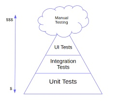

# Introduction

Testing is one of the core pillars of software development. It is the only way to
guarantee that functionality fits the requirements and the application is stable.


## Testing pyramid

There are several layers related to testing:



There are 2 sides to the testing pyramid:
1. Technical value
2. Business value

Technical value:
    - Unit tests are responsible for testing individual units of code.
    They are as isolated and requirement specific.
        * ex:
    ```js
    function sum(a, b) {
        return a + b;
    }

    test('adds 1 + 2 to equal 3', () => {
        expect(sum(1, 2)).toBe(3);
    });
    ```
    We should start of a simple general case test. Afterwards we can write
    edge-case tests.

    - Integration tests groups of functionality as a whole.
        * ex: Test user logging in.

    - End-To-End testing verifies complete system flow, from back-end to
    front-end
        * ex: Add a note in a todo app, and verify there is a change in the database.


## General testing rules
- Each test should focus only on one thing
- External dependencies should be mocked
- Have configuration, rather than, hard coding values
- If the test subject has a critical error all test should fail
- Don't put logic in tests like loops or conditionals
- Don't have unnecessary assertions
- Extract common setup and logic
